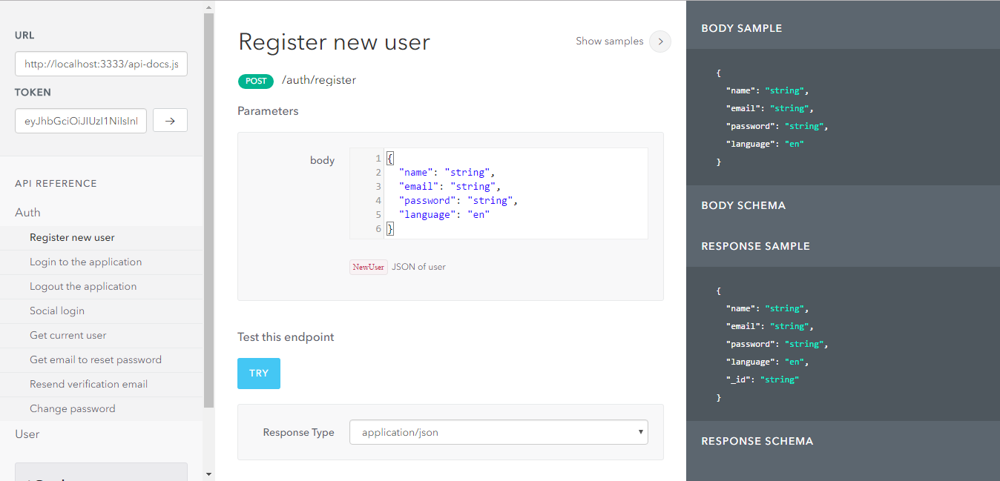

# AdonisJs + LucidMongo + Swagger jsdoc Application

## :arrow_up: How to Setup

**Step 1:** git clone this repo:

**Step 2:** cd to the cloned repo:

**Step 3:** Install the Application with `npm install`

* The `.env` file is ignored by git keeping those secrets out of your repo.

**Step 4:** copy file `.env.example` to `.env`

**Step 5:** change default config in `.env` file

## :arrow_forward: How to Run App

1. cd to the repo
2. Run `adonis serve --dev`

**Explore to Swagger page:**
 [http://localhost:3333/docs](http://localhost:3333/docs)
 
 

 ## test
 
 copy file `.env.example` to `.env.test`
 
 `npm run test`

## License
